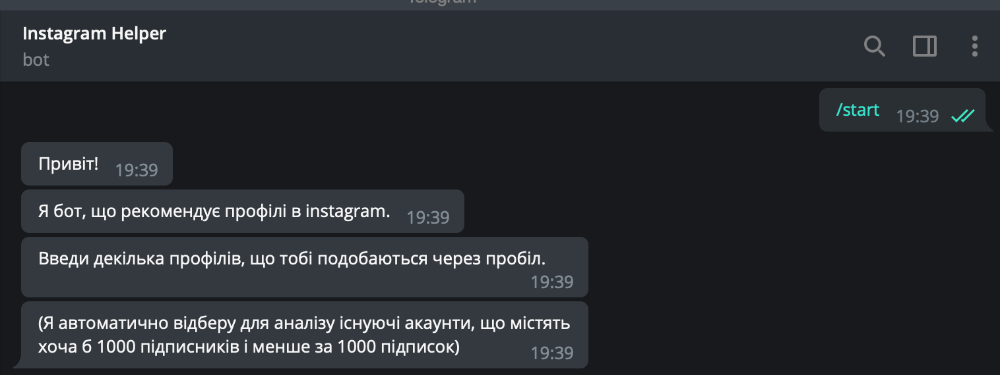

# Instagram Helper Bot


## Table of contents
* [Description](#description)
* [Installation](#installation)
* [Usage](#usage)
* [Screenshots](#screenshots)
* [Credits](#credits)
* [License](#license)


## Description:
Telegram bot that will help you effectively use your Instagram profile.
Its main functions include:
* Getting a list of recommended Profiles
* Viewing posts of the given profiles
* Visiting this accounts by link

## Installation:
```bash
pip install -r requirements.txt
```
(If you get unexpected errors from the igramscrapper,
 clone the [repository](https://github.com/realsirjoe/instagram-scraper)
 and put igramscraper folder in the project folder)

 ## Usage
 The project consists of 4 module packages and one main module: [bot.py](bot.py)
 ### Package [instagram](modules/instagram)
 #### Contains two modules:
 * [parser.py](modules/instagram/parser.py)
 * [user_interaction.py](modules/instagram/user_interaction.py)
 
 The first one allows user to access instagram profiles with requests and BeautifulSoup libraries
 
 It contains two classes:
 
 `HtmlParser` and `InstagramParser`
 
  The main `HtmlParser` method is  `parser(self)` - it returns a `BeautifulSoup` object for the given url 
  It also can change the url with `@url.setter` (parser is changed as well) and get its value
  
  `InstagramParser` is a child class of `HtmlParser` and has some specific methods to work with instagram
  This class is initialized with given username and allows to get user's followers, follows and posts count
  It also can check if the user is private with `is_private` property
  
  The second module is used to interact with user. It contains only two functions:
  
  `analyze(usernames, model, dataframe, stop_words, length)` - this function recommends some profiles based on the machine learning model and dataframe with clusters, `stop_words` paramether helps with deleting unnecessary words in the posts captions of the given users (the function analyzes them) and the last one `length` checks if the resulting length is greater than the given value
  
  `get_first_post(username)` - allows to get the first post link for the given user
  
  ### Package [containers](modules/containers)
  #### Contains four modules:
  * [multiset.py](modules/containers/multiset.py) - implementation of the `Multiset`
  * [node.py](modules/containers/node.py) - implementation of the `Node` for linked structures
  * [text_container.py](modules/containers/text_container.py) - implementation of the `TextContainer ADT`
  * [profiles_container.py](modules/containers/profiles_container.py) - implementation of the `ProfilesContainer ADT'
  
  `TextContainer` is used for text processing and deletting unnecessary data
  It is a child class of `Multiset` and has 3 important methods: 
  `process_text(str)` - removes unimportant data
  `process_container()` - processes all the texts in container
  `join_with(str)` - joins all texts with given string
  
  `ProfilesContainer` is used for containing users and their posts
  It has three specific methods:
  `get_posts(username)` - get posts of the givem user and saves them in the container
  `check_user(username)` - checks if user satisfies the conditions
  `collect_texts()` - collects all posts captions and processes them with the `TextContainer`
  
  ### Package [data_processor](modules/data_processor)
  #### Contains only one module: [model.py](modules/data_processor/model.py)
  This module processes the [data](data) and creates a machine learning model for clusterisation of users
  
  ### Package [data_collector](modules/data_collector)
  #### Contains two modules:
  * [processor.py](modules/data_collector/processor.py) - contains `Processor` class (collects data from the Instagram)
  * [data_collector.py](modules/data_collector/data_collector.py) - contains some functions that use `Processor` class to get data
  `Procerror` class has a lot of methods. Here are some examples:
  
  `login(username, password)` - performs logining process
  
  `scroll(scrollbar)` - scrolls the given scrollbar
  
  `get_following(username)` - get follows of the user
  
  ...
  
 
 ## Screenshots
 
### Bot meets you with a greeting message



### Bot sends some recommendations


## Credits:
* Diana Kmet
* Maksym Protsyk

## License
[MIT](https://choosealicense.com/licenses/mit/)
